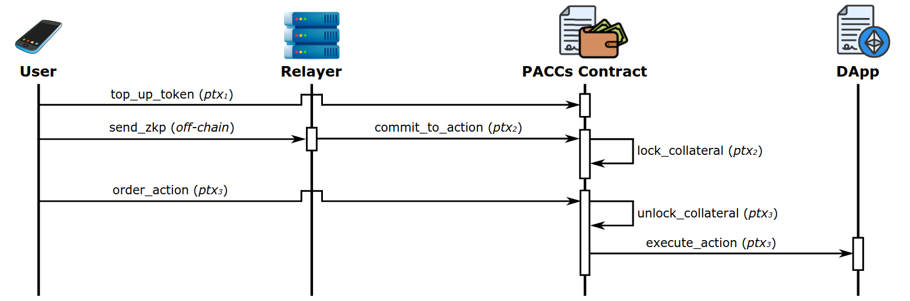

# PACCs PoC Implementation Specification

Specification referring to the commit: [ca9a4dfccb136334863bcea5c98fe9536e40cf2b](https://github.com/xevisalle/paccs/commit/ca9a4dfccb136334863bcea5c98fe9536e40cf2b)

## Protocol Overview

Private, Anonymous, Collaterizable Commitments (PACCs) is a protocol to prevent maximal-extractable value (MEV) attacks in Decentralized Finance (DeFi). It is a commitment protocol based on smart contract wallets (SCWs) and Zero-Knowledge Proofs (ZKPs), that can be used to convince a relaying party that the user generating the PACC proof has enough funds to pay the required fees, that its wallet is committed to perform certain actions, and that the wallet loses some amount of collateral if this commitment is broken. Our PACCs proof-of-concept implementation, takes as an example the scenario where a user owning an External Owned Account (EOA) on Ethereum, is willing to perform a token exchange by means of the PACCs protocol, thus preventing any kind of MEV attack. We have three actors: the user willing to perform the exchange, a relaying party that forwards users' commitments to perform certain actions, the PACCs contract, and the DApp (in our PoC, a Decentralized Exchange (Dex)). The action can be performed by means of three transactions $(ptx_1, ptx_2, ptx_3)$. A simplified high-level overview of the protocol steps, for the sake of completeness, is as follows (and depicted in the following figure):

- **(user) top_up_token ($ptx_1$)**: send an amount of a given token to the PACCs contract, along with a $commitment Hash(r, S)$. Once the token is received, if the balance is greater than the collateral, the contract updates the user account with the new amount and adds the providedm commitment to the contract state. At this point, the commitment publicly belongs to ”someone” having enough funds to pay for the collateral. Plus, the tokens can only be spent if the opening to the commitment is revealed.

- **(user) send_zkp (off-chain)**: when a DApp action wants to be performed, the user first needs to commit to such action. As such, the user sends a PACCs ZKP to the relayer.

- **(relayer) commit_to_action ($ptx_2$)**: if the ZKP verifies, the relayer forwards the commitment $Hash(tx)$ and the value $S$ to the PACCs contract.
  
- **(PACCs contract) lock_collateral ($ptx_2$)**: upon receiving the commitment, the collateral gets locked in the contract. In particular, it places a restriction where the opening to the commitment $Hash(tx)$ needs to be revealed by who committed to $Hash(r, S)$ using $S$.
  
- **(user) order_action ($ptx_3$)**: after some time, the user orders the action, by issuing the promised transaction, thus revealing $tx$. Plus, the previous $r$ opening is revealed, and also a fresh new commitment $Hash(r, S)$ is provided.
  
- **(PACCs contract) unlock_collateral ($ptx_3$)**: if everything worked with no aborts, the collateral gets unlocked by removing the restriction.
  
- **(PACCs contract) execute_action ($ptx_3$)**: if the received order was indeed committed previously (i.e. the transaction itself is correct), the action is executed by calling the DApp. Plus, the commitment stored in the PACCs contract state gets replaced by the new one (or the existing one gets deleted if not enough funds remain to perform a new exchange).

## Cryptographic Primitives

We use different cryptographic primitive and specific implementations in our PoC. We summarize the most important ones here:

- [**Plonk:**](https://eprint.iacr.org/2019/953.pdf) this is the ZKP scheme used to prove the commitment to the relayer. The particular implementation we used is the one from [**snarkjs**](https://github.com/iden3/snarkjs), along with the [**circom**](https://docs.circom.io) tool to write the circuit used in our protocol. Plonk has been chosen due to it being universal: a same trusted setup can be used in any circuit. Plus, it is also updatable: anyone can provide randmoness to the setup.
- [**Poseidon:**](https://eprint.iacr.org/2019/458.pdf) this is the hash function used as a commitment scheme. It has been chosen due to its efficiency when computed in-circuit, and its integration with **circom**.

## PoC Modules

Now we give an overview on the implemented modules.

### Contracts

The smart contracts involved in the PACCs protocol. Into the module, you can find the following Solidity contracts:

- **Exchange.sol:** a basic sample contract simulating a DeX. It holds a custom token called TOK, that can be exchanged by Ether.
- **Paccs.sol:** the core contract of our protocol. It is basically a SCW, that allows users to store their money in there, and perform the exchange of TOK by means of our MEV-secure protocol.
- **Token.sol:** a basic sample contract deploying the TOK ERC20 token.

Additionally, our code also depends on the external library contracts **PoseidonT3.sol** and **PoseidonT4.sol** to use the Poseidon hash function in-contract.

You can find an explanation on how to test and deploy the contracts using a development network in the module's README.

### Client

The module used to interact with the contracts, once deployed on a Ethereum devnet. It also contains the tools required for the communication between a user and a relayer. It has been coded in Javascript using Node, so it is easy portable to webapps. It allows users to tansfer money, top up the SCW, and order actions, among other features. It also allows relayers to forward users' commitments.

Furthermore, it includes the circom circuit to allow users to compute the ZKPs for the relayers, and for the relayers to verify them.

You can find an explanation on how to compile the circuit, and how to test the overall code in the module's README.

### Zkp

This module contains the circuit used in the PACCs protocol, but implemented using the `dusk-plonk` Rust implementation of Plonk. It doesn't integrate with the rest of our stack, we provide it just for the sake of benchmarking.

## Other Considerations and Conclusions

The code in this repository is currently unstable. Furthermore, it has not gone through an exhaustive security analysis, so it is not intended to be used in a production environment, only for academic purposes. 

In order to deploy and integrate our solution into a specific application (e.g. a webapp allowing to perform token exchanges), it is first required to deploy the contract on an Ethereum network, for instance, a local devnet or a public testnet. Next, the webapp can be built following the code written in the tests of our **client**, which will interact with the PACCs contract. In the same way, the communication between the user and the relayer can be implemented by means of the code found in our client (i.e. the code to generate and verify proofs).

At the moment, the code uses Merkle trees of depth 4 for testing purposes, this needs to be updated according to the needs of the final application. Likewise, some parameters like the collateral amount need to be updated in the contract.
